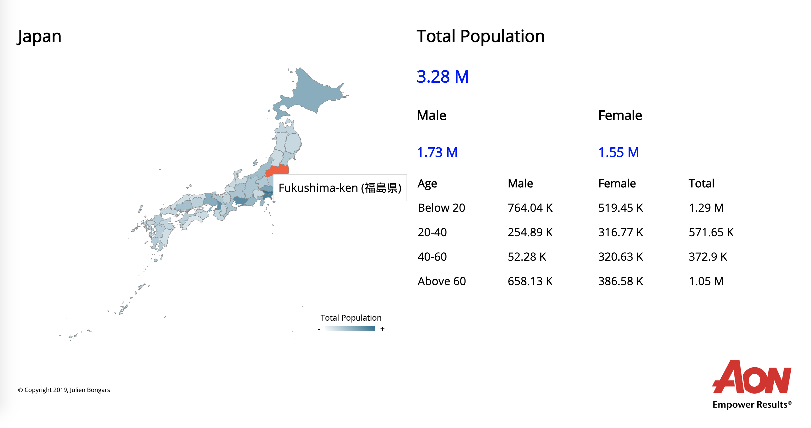

# Japan Dashboard

## Prerequisites

- NPM v6.11.3
- Node v10
- Requires installing and running [JBongars/japan-dashboard-api](https://github.com/JBongars/japan-dashboard-api)

## Preview

## Build

Run the following command to build the project: `npm run build`

## Start

Run the following command to run the project `npm run start`. Note that the service should start on http://localhost:3000

## NOTE

This project is currently incomplete. Please find a list of the following issues which have yet to be resolved:

1. Currently there are no working unit tests. These need to be updated
2. Currently there are not e2e tests. These need to be implemented
3. Current version of Typescript is out of date. Considering upgrading for stability
